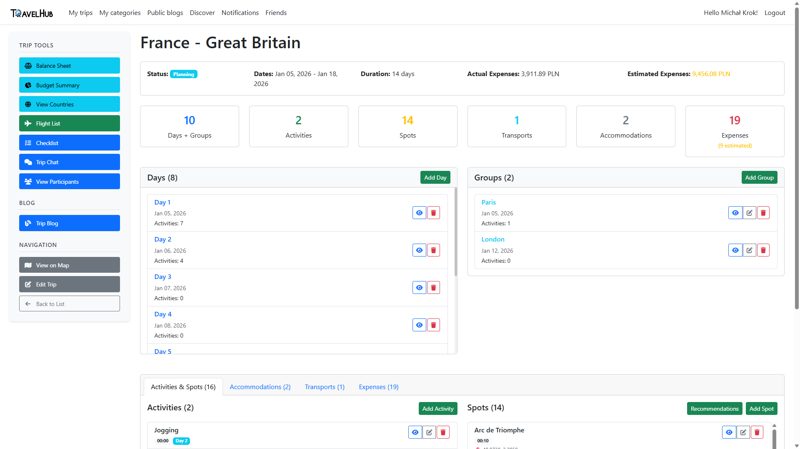
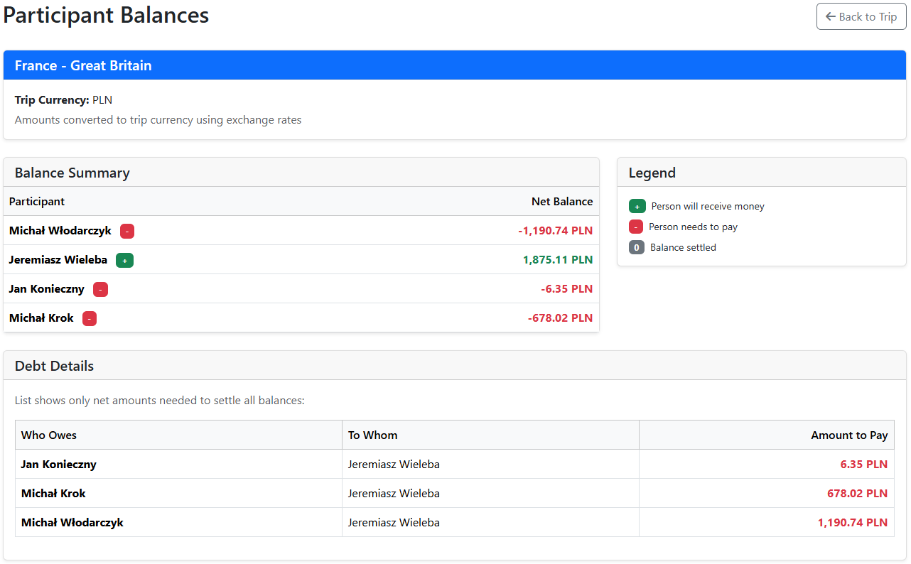
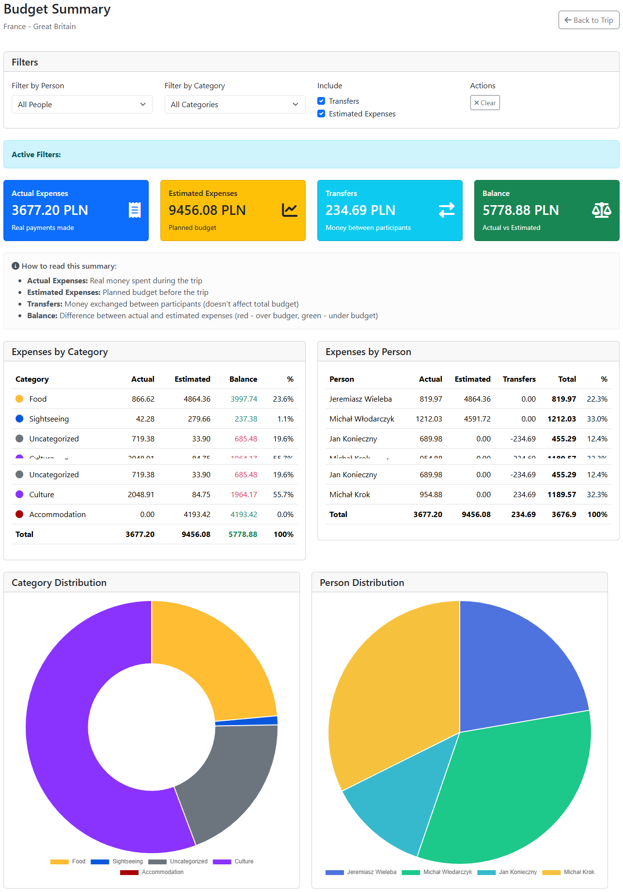
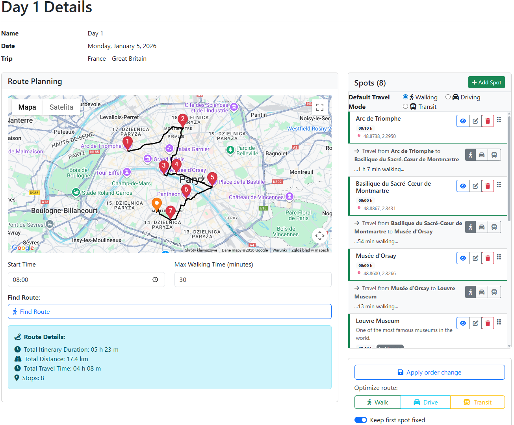
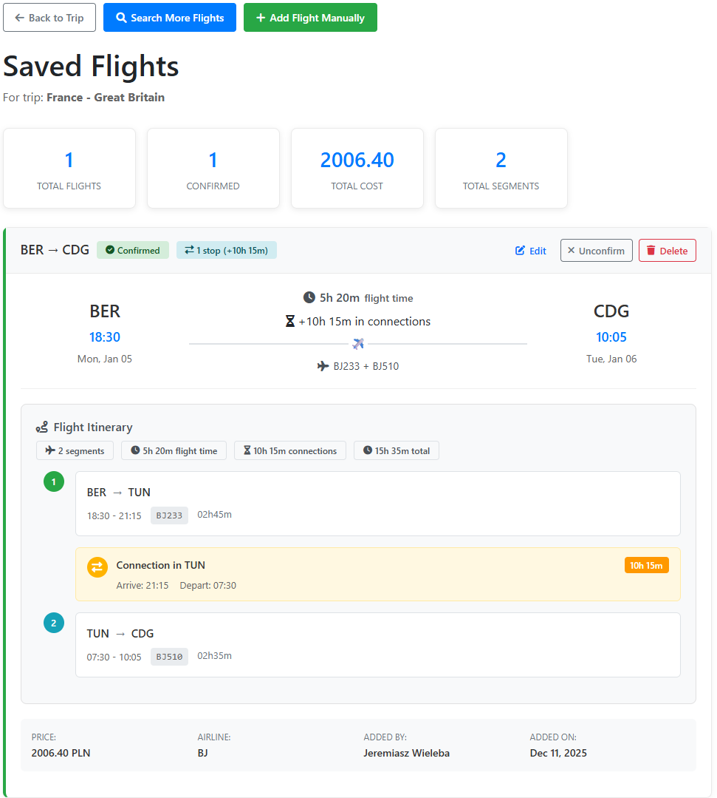
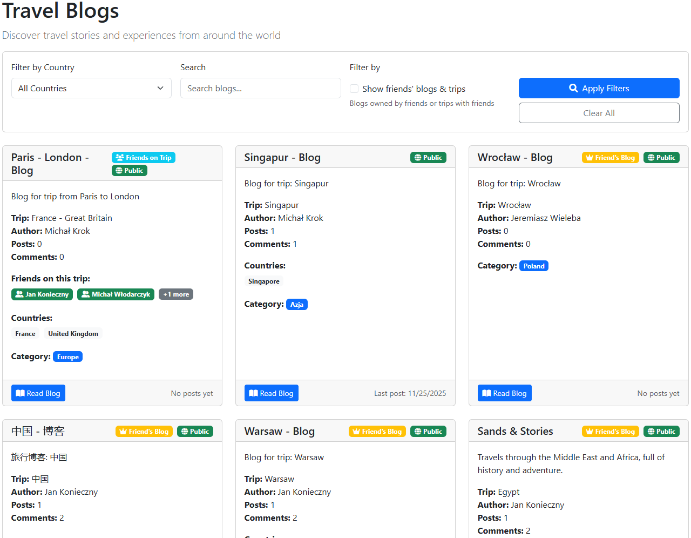

# TravelHub 🌍

**Comprehensive web application for planning, documenting, and managing travel itineraries.**

TravelHub is a group project developed at **Wrocław University of Science and Technology** (Faculty of Information and Communication Technology). It solves the problem of scattered travel information by integrating itinerary planning, budget tracking, and social sharing into a single platform.

---

## Table of Contents
- [About the Project](#-about-the-project)
- [Key Features](#-key-features)
- [Architecture & Technology](#-architecture--technology)
- [Algorithm (Route Optimization)](#-algorithm-route-optimization)
- [Getting Started](#-getting-started)
- [Screenshots](#-screenshots)
- [Authors](#-authors)

---

## About the Project

TravelHub was designed to minimize the time cost of organizing trips. Unlike standard calendar apps, TravelHub combines logistical organization with travel journaling. It allows users to create detailed daily plans, manage shared budgets with multi-currency support, and discover new destinations through community blogs.

**Project Status:** Completed (2025)

See the full [Technical Documentation](docs/TravelHub%20-%20dokumentacja%20techniczna.pdf).

---

## Key Features

### Trip Planning & Logistics
* **Interactive Itinerary:** Drag-and-drop planning for days, spots, and activities.
* **Map Integration:** Visualizing routes using **Google Maps API**.
* **Conflict Detection:** Automatic warnings for overlapping activities or tight schedules.
* **Flight Search:** Integrated with **Amadeus API** to find and save flight connections.

### Budget Management
* **Multi-currency Support:** Add expenses in any currency; the system automatically converts them to the trip's base currency (using **NBP API** rates).
* **Debt Settlement:** Algorithms to calculate "who owes whom" to simplify group settlements.
* **Expense Categorization:** Visual charts and reports for spending analysis.

### Collaboration & Social
* **Group Trips:** Invite friends, edit plans in real-time, and assign tasks via Checklists.
* **Travel Blog:** Create rich posts with photos to share experiences.
* **Discovery Mode:** Browse public trips and blogs for inspiration.
* **PDF Export:** Generate travel summaries and reports (using `DinkToPdf`).

---

## Architecture & Technology

The system follows **Clean Architecture** principles to ensure scalability and testability.

### The Stack
* **Backend:** .NET Core (ASP.NET Core)
* **Database:** MS SQL Server, Entity Framework Core (Code First)
* **Frontend:** Razor Pages / MVC (CSHTML 5), JavaScript
* **Auth:** ASP.NET Identity

### Architectural Layers
1.  **Domain:** Entities, DTOs and interfaces.
2.  **Infrastructure:** Implementation of repositories, business logic services, and external API integrations.
3.  **Web:** Presentation layer (MVC + ViewModels).

### External APIs
* **Google Maps API:** Maps visualization and places data.
* **Amadeus API:** Flight search engine.
* **NBP API (National Bank of Poland):** Current exchange rates.

---

## Algorithm: Route Optimization

One of the standout features of TravelHub is the intelligent ordering of sightseeing spots. We implemented the **Simulated Annealing** algorithm to solve the Traveling Salesperson Problem (TSP) within the context of a daily itinerary.

* The system proposes the optimal order of visiting selected spots to minimize travel time.
* It respects user-defined constraints (e.g., specific start times for fixed attractions).

---

## Getting Started

To run this project locally:

### Prerequisites
* .NET SDK (compatible with the project version)
* SQL Server (LocalDB or full instance)
* API Keys for: Google Maps, Amadeus.

### Installation

1.  **Clone the repo:**
    ```bash
    git clone [https://github.com/Michalnr1/TravelHub.git](https://github.com/Michalnr1/TravelHub.git)
    ```
2.  **Configure `appsettings.json`:**
    Update the connection string and insert your API keys.
    ```json
    "ConnectionStrings": {
      "DefaultConnection": "Server=(localdb)\\mssqllocaldb;Database=TravelHubDb;..."
    },
    "ApiKeys": {
      "GoogleApiKey": "YOUR_KEY_HERE",
      
    },
    "Amadeus": {
        "Id": "YOUR_ID_HERE",
        "Secret": "YOUR_SECRET_HERE",
        "RateLimit": {
          "MaxRequests": 1,
          "WindowSeconds": 0.1
        }
      }
    ```
3.  **Apply Migrations:**
    Open the terminal in the project directory and run:
    ```bash
    dotnet ef database update
    ```
4.  **Run the application:**
    ```bash
    dotnet run
    ```

---

## Screenshots

| Trip Overview | Balance Sheet |
|:---:|:---:|
|  |  |
| *Managing days and activities* | *Participants balances* |

| Budget Summary | Map Planning |
|:---:|:---:|
|  |  |
| *Charts and balance calculation of trip expences* | *Route optimization on map* |

| Flight List  | Public Blogs |
|:---:|:---:|
|  |  |
| *Saved flights view* | *Travel blogs* |

---

## Authors

**Team:**
* **Jan Konieczny**
* **Michał Krok**
* **Jeremiasz Wieleba**
* **Michał Włodarczyk**

**Supervisor:**
* Aleksandra Kawala-Sterniuk, DSc (Eng.), Associate Professor

---
*Project created for "Zespołowe Przedsięwzięcie Inżynieryjne" (Team Engeneering Project) at Wrocław University of Science and Technology, 2025.*